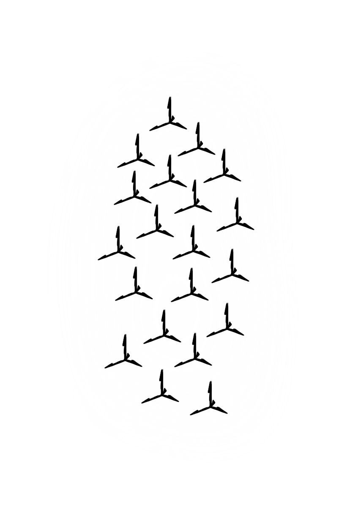

# Ψηφιακά Παιχνίδια και Παιγνιώδης Μάθηση - Εργασία Εξαμήνου
### Πανεπιστήμιο Αιγαίου - ΤΜΣΠΣ
### Χειμερινό Εξάμηνο 2022 - 23
### Υπεύθυνος Καθηγητής: [Αλέξανδρος Μερκούρης](https://github.com/merkourisa)

# Στοιχεία
### Ονοματεπώνυμο: Συμεών Γαλανός
### Αριθμός Μητρώου: Dpsd16016
### Προσωπικό Προφίλ GitHub:  https://github.com/Dpsd16016
### Διεύθυνση Παιχνιδιού:  [The Mad Ronin](https://dpsd16016.github.io/Role-Playing-Game/)

# Εισαγωγή

 Σύμφωνα με τις οδηγίες της εργασίας στόχος ήταν η δημιουργία ενός Role Playing Game. Σαφώς αυτή η κατηγορία ηλεκτρονικών παιχνιδιών εμφανίζει πολλά ιδιαίτερα ποιοτικά χαρακτηριστικά αλλά και πλήθος παραλλαγών ( MMO RPG, single player RPG κ.λ.π). Στα πλαίσια της εργασίας ωστόσο δεν έχει τόσο νόημα να μιλάμε για ολοκληρωμένη οργάνωση ενός τέτοιου παιχνιδιού, τόσο η επίτευξη του σε κώδικα αλλά και η σχεδίαση-Design είναι πολύ πιο απαιτητική από ότι επιτρέπουν οι γνώσεις ενός αρχάριου να διαχειριστεί. Ως απόρροια αυτού, μας δόθηκε η δυνατότητα να ακολουθήσουμε ένα εκπαιδευτικό "εγχειρίδιο", κατευθυντήριο για τη παραγωγή ενός πρώιμου παιχνιδιού. Βασισμένοι πάνω σε αυτό καλούμαστε να δημιουργήσουμε ένα κατά το δυνατό καινούριο αποτέλεσμα. Κύριος στόχος είναι να επιτευχθεί η διαφοροποίηση στη θεματική και κατ' επέκταση οπτική έκφανση του παιχνιδιού χωρίς αυτό να αποκλείει προσθήκες στο κώδικα π.χ. νέα mechanics.

# Περίληψη

### Υπόθεση: 
Ο πρωταγωνιστής samurai της ιστορίας αναζητά τον υπαίτιο για τον αφανισμό του αφεντικού του. Στόχος η εκδίκηση... Ηχηρές ενδείξεις τον οδηγούν στο σπίτι ενός περίφημου ευγενή. Μέσα από αλληλεπιδράσεις και σκηνές θα μάθουμε τι πραγματικά συνέβη.

### Εχθροί:
- Τοξότες :bow_and_arrow: ή Ninja :dagger:
- Πολεμιστές :crossed_swords:
- Boss :coffin:

### Εργαλεία για Ανάπτυξη:
- [ProCreate](https://procreate.art) :fountain_pen:
- [Unity Engine](https://unity.com) :desktop_computer:

# Πρώτο Παραδοτέο

## Απόφαση θέματος

 Η προσέγγιση μου στο θέμα ήταν παρορμητική και λίγο ασφαλής. Αποφάσισα εξ' αρχής να ακολουθήσω μια αρκετά γνώριμη σε εμένα θεματική και συγκεκριμένα περί Samurai και Ninja. Ως αφορμή του προσανατολισμού αυτού στάθηκε ένα πολύ αγαπημένο μου παιχνίδι, το [Ghost of Tsusima](https://www.playstation.com/en-gr/games/ghost-of-tsushima/). Σε αυτό μπορούσα να ανατρέξω για ιδέες αναφορικά με στοιχεία του κόσμου μου κλπ. Γνώριζα ότι το θέμα αυτό θα με κάλυπτε επαρκώς στο ζήτημα της μάχης αλλά και ότι αποτελεί ένα διάσημο και επιτυχημένο setting. Αναφορικά με όλες τις πρακτικές απαιτήσεις της εργασίας η θεματική δεν είναι εμπόδιο. Στο θεωρητικό ερώτημα του κατά πόσο ένα τέτοιο setting μπορεί να υποστηρίξει το rpg format, η απάντηση είναι ότι μπορεί καθώς έχει ήδη γίνει π.χ. [Oreshika: Tainted Bloodlines](https://www.youtube.com/watch?v=CzRz-xE53Xk) αλλά πάντα μπορεί να υπάρξει και πρωτοτυπία.

## Αισθητική Κόσμου 

- Το πρώτο πράγμα που σκέφτηκα να κάνω ήταν ένα σχέδιο με σκοπό να αντλήσω έμπνευση. Παράλληλα είχα την ιδέα αυτό να αποτελέσει και το αρχικό μενού. Ως εκ τούτου έπρεπε να πληρεί μερικές ακόμα προδιαγραφές δηλαδή, να έχει χώρο για τις επιλογές του μενού και να έχει οριζόντιο προσανατολισμό. Αφού ο σχεδιασμός επιτεύχθηκε σε ένα ικανοποιητικό βαθμό αποφάσισα να το κρατήσω αλλά και να βασίσω το πρωταγωνιστή στο χαρακτήρα της σκηνής. Το εν λόγω σχέδιο κατά τη συνήθεια μου ήταν ασπρόμαυρο κάτι που με ώθησε να ακολουθήσω τη γραμμή αυτή και εντός παιχνιδιού. Το ασπρόμαυρο παραπέμπει άμεσα σε κλασικό Ιαπωνικό κινηματογράφο αλλά αποτελεί και πλεονέκτημα διότι δεν απαιτείται καθορισμός χρωματικής παλέτας.

- Μια καθοριστική απόφαση ήταν το να σχεδιάσω εξ' ολοκλήρου το κόσμο και ότι περιλαμβάνεται σε αυτόν μόνος μου αντί να αξιοποιήσω έτοιμα assets. Οι παράγοντες που συνέβαλλαν στην απόφαση ήταν δύο. Πρώτων ήθελα να ανεβάσω τις απαιτήσεις ώστε να πετύχω πιθανώς υψηλότερο βαθμό. Δεύτερον προτιμούσα να παράξω κάτι σύμφωνα με την αισθητική μου ώστε το τελικό προϊόν να είναι πιο προσωπικό και συνεκτικό. Αποτέλεσμα είναι ένας λεπτομερής αλλά και σκοτεινός κόσμος.

## Σχεδιασμός Χαρακτήρα

Ο σχεδιασμός του βασικού χαρακτήρα ήταν απλός. Όπως ανέφερα, βάσισα την όψη του στο χαρακτήρα του πρώτου σχεδίου. Οι αναλογίες του σώματος in-game είναι αρκετά ρεαλιστικές και όχι το σύνηθες, σε παιχνίδια 2D, δυσανάλογο πρότυπο. Έκανα αυτή την επιλογή επίτηδες για να μην αποσπά από το σοβαρό ύφος.

## Σχεδιασμός Χάρτη

 Στην αρχή καθόρισα το layout σχεδιαγραμματικά σκεπτόμενος διάφορα στοιχεία, κλασικού Ιαπωνικού Estate, που ήθελα να δείξω. Εντομεταξύ, η σκηνή που παρουσιάζεται στο αρχικό μενού αποτελεί βεβαίως την εισαγωγή του χρήστη στο κόσμο και προδιαθέτει το ύφος αλλά αποφάσισα να συνδέεται και τοπικά. Έτσι ο πρωταγωνιστής έχει φαινομενικά το ίδιο σημείο έναρξης στο χάρτη με αυτό που διαδραματίζεται η αρχική σκηνή. Στη συνέχεια ξεκίνησα να σχεδιάζω το χάρτη λεπτομερώς (Procreate) όπως θα ήθελα ιδανικά να είναι. Ωστόσο, από αυτό σύντομα προέκυψε ένα ζήτημα. Εγώ σχεδίαζα το χάρτη σαν ολότητα με οργανικότητα και πλήθος υφών. Αυτό όμως δεν μπορούσε να στηριχθεί καλά στη σχεδιαστική διαδικασία του tutorial που υποδεικνύει μια πιο απλοϊκή προσέγγιση η οποία ενισχύει το σχεδιασμό μέσω tilesets. Εγώ απο την άλλη επιθυμούσα μεγαλύτερη λεπτομέρεια και λιγότερη καθετότητα, αρα δε μπορούσα να σχεδιάσω εύκολα με αυτή τη λογική. Ύστερα από συζήτηση με το καθηγητή αποφάσισα να ρισκάρω σχεδιάζοντας πλήρως το χάρτη. Στη συνέχεια θα τον αποκέκοπτα στο κατάλληλο grid με tiles ώστε να μπορώ να μοιράσω colliders στο εγγύς μέλλον. Τέλος σχεδίασα και μερικά διακοσμητικά στοιχεία.

# Δεύτερο Παραδοτέο

Το δεύτερο παραδοτέο έχει ως επίκεντρο το να δωθεί μια σπίθα ζωής στον προσχεδιασμένο εικονικό κόσμο μας. Όλες οι παρακάτω προσθήκες αποτελούν βήματα προς αυτό το στόχο, δίνοντας έτσι τη διάσταση της διάδρασης και της ανάδρασης στο gameplay.

## Colliders

Αναφορικά με τα colliders η προσέγγιση μου ήταν διαφορετική από το tutorial που μας έχει δοθεί. Όπως αναφέρεται και εντός του, η χρήση collider σε tiles αποτελεί διευκόλυνση στη περίπτωση επαναχρησιμοποίησης αυτών. Ωστόσο όπως έχω αναφέρει και στο σχεδιασμό χάρτη, ο τρόπος που το προσέγγισα εξ αρχής ήταν ώστε κάθε πίστα να είναι μοναδική χωρίς επανάληψη και άρα αυτός ο τρόπος δε μου ήταν χρήσιμος. Αντ'αυτού έβαλα Colliders με τη χρήση polygon σε όλα τα σημαντικά σημεία του χάρτη ως ξεχωριστά game object.

## Items

Το item το οποίο είχα σκοπό να προσθέσω ανέκαθεν, ήταν φυσικά αυτό του healing. Το σχέδιο είναι, μια τυλιγμένη γάζα πάνω σε άσπρο φόντο ώστε να φαίνεται ξεκάθαρα στον ασπρόμαυρο χάρτη. Πέραν αυτού δεν σχεδίασα κάτι περισσότερο, αυτό όχι λόγω έλλειψης ιδεών αλλά διότι θεώρησα πως items τύπου buff δεν ήταν ουσιαστικής σημασίας ακόμα σε ένα τόσο πρώιμο στάδιο του παιχνιδιού (αυτό ωστόσο χρίζει επανεξέτασης και ενδέχεται να αλλάξει ανάλογα με την εξέλιξη).

## Damage Zone

Στη κατηγορία damage zones προσπαθούσα να σκεφτώ ένα αντικείμενο που να έχει συνοχή με το θέμα αλλά και να μην είναι πολύ εξαρτημένο από τα περιβαλλοντικά στοιχεία ώστε να μπορεί να αξιοποιηθεί αντιστοίχως και στην επόμενη πίστα. Έτσι κατέληξα στα spikes (tatsubishi) τα οποία χρησιμοποιούνται από ninja σαν παγίδα στο πάτωμα με αποτέλεσμα να τρυπάνε τα πόδια εχθρών. Αυτό με κάλυψε πλήρως και ταιριάζει καθώς σκοπεύω να προσθέσω και εχθρό ninja στο εγγύς μέλλον. 

## Figures

Σε αυτό το παραδοτέο έγινε προσθήκη ενός εχθρού με τη μορφή Samurai και η νέα μορφή του βασικού χαρακτήρα. Μετά από εξέταση in-game παρατηρήθηκε η ανάγκη για διόρθωση στην απεικόνιση π.χ. κάποιες λεπτές γραμμές χαλάγανε. Αν υπάρξει λόγος θα γίνουν περαιτέρω αλλαγές εν καιρό.

 

## Animation

Για να καλυφθούν οι απαιτήσεις του δεύτερου παραδοτέου έπρεπε να γίνει προσθήκη κίνησης στους χαρακτήρες, ωστόσο ορισμένες από αυτές που προτείνει το tutorial π.χ. χορός του ρομπότ, αγνοήθηκαν ώστε να υπάρχει συνοχή με το θέμα. Οι κινήσεις σχεδιάστηκαν frame by frame στο procreate και προστεθηκαν σα sprites. Αυτές είναι οι παρακάτω και αφορούν μόνο τις τέσσερεις βασικές κατευθύνσεις (Βοράς, Νότος, Ανατολή, Δύση).

### Opponent 
- Walk (Η ενταξη του έγινε σύμφωνα με το tutorial)

### Main Character 
- Idle (Η ένταξη του έγινε με οδηγίες εξωτερικής βοήθειας)
- Walk  (H ένταξη του έγινε όμοια με το animation του εχθρού όπως στο tutorial)
- Strike (Η ένταξη του έμεινε ημιτελής - Περισσότερα στην Ενότητα προβλήματα) **
- Death (H ένταξη του δεν πραγματοποιήθηκε ακόμα καθώς δεν ήταν απετούμενο - δεν υποδικνύεται στο tutorial)

Θα προστεθούν και όποιες άλλες απαραίτητες κινήσεις καθώς το παιχνίδι θα εξελήσεται στη διάρκεια του τρίτου παραδοτέου.

**_Σημείωση_**
- Επειδή το animation γίνεται (σχεδιαστικά) frame by frame (απαιτεί πολύ χρόνο και ενέργεια) δεν είναι εύκολο να πραγματοποιηθεί μια πολύ ρευστή κινησιολογία ελπίζω όμως ότι θα μπορω να το βελτιώσω περισσότερο.

## Projectiles

Με γνώμονα το Concept ο κύριος χαρακτήρας δεν έχει projectile animation ως τη βασική επίθεση. Ήταν βέβαια μια αρχική σκέψη (το δοκίμασα) αλλά αποφάσισα να το αφήσω στην άκρη και ως κάποια πιθανώς δευτερεύουσα επίθεση ή special skill αν ο χρόνος και οι γνώσεις το επιτρέπουν. Αντ'αυτού η βασική κίνηση θα είναι Melee attack κάτι που προσπάθησα να πετύχω με εξωτερική βοήθεια και ακόμα δεν είναι τελειοποιημένο (περισσότερα στην ενότητα Προβλήματα). **

## Προβλήματα
Η συγκεκριμένη ενότητα είναι συμπληρωματική και πιθανώς θα διαγραφεί πριν το τέλος του τρίτου παραδοτέου. Παρακάτω παραθέτω τα προβλήματα που εμπόδισαν την άρτια ολοκλήρωση του παραδοτέου, αυτά θα είναι προς επίληση, με τη βοήθεια του καθηγητή, μετα την επιστροφή απο τις διακοπές. Εύλογο είναι το ερώτημα του γιατί δεν ήρθα να τα διορθώσω με βοήθεια στο τελευταίο μάθημα 16-12-22. Πράγματι ίσως θα είχαμε επιλύσει τα ζητήματα αλλά δυστυχώς για προσωπικούς λόγους αναγκάστηκα να φύγω 1 μέρα πριν στις 15-12-22 και φυσικά  εξ' αποστάσεως δε μπορώ να τα διορθώσω διότι δεν έχω πρόσβαση στον υπολογιστή... Αντιλαμβάνομαι οτί αυτό μπορεί να δημιουργήσει δυσαρέσκια αλλά ελπίζω να μην έχει μεγάλο αντίκτυπο στο βαθμό.

- **Αποτυχία λειτουργίας βασικής επίθεσης:**
Με μεγάλη απογοήτευση ομολογώ ότι δε κατάφερα να εντάξω τη βασική επίθεση. Τα animation αρχεία έχουν γίνει κανονικά όπως και το δέντρο στον animator αλλά οι μεταβάσεις μεταξύ τους και ο κώδικας δεν δούλεψαν αν και ακολούθησα οδηγίες από βίντεο. Τελικά οι πολλές πηγές πληροφόρησης πιο πολύ μπερδεύουν παρά βοηθούν, στο κάθε ένα η μέθοδος είναι λίγο διαφορετική και δυστυχώς δεν υπάρχει εύκολος τρόπος να τα συσχετίσεις κάτι στο οποίο η μεγάλη απειρία μου στον κώδικα δε βοήθησε καθόλου. Προφανώς και επισκεπτόμουν την ενότητα issues, με αρκετούς είχαμε παρόμοια προβλήματα ωστόσο δε κατάφερα να λήσω το φλέγων εγκαίρως. Σε κάθε περίπτωση στην ενότητα πηγές έβαλα τα βίντεο που παρακολούθησα.

- **Κάμερα:**
Η κάμερα του παιχνιδιού έτσι όπως φαίνεται στο link δυστυχώς βγαίνει εκτός ορίων του χάρτη. Αυτό οφείλεται στο ότι όταν είχα κάνει το συγχρονισμό αυτό δεν είχα ολοκληρώσει την εργασία της κάμερας. Το πρόβλημα προέκυψε όταν ολοκλήρωσα με επιτυχία τη σωστή λειτουργία της κάμερας με χρήση cinemachine όπως στο tutorial. Αυτό διότι τότε δε με άφηνε να κάνω build and run το game. Βέβαια τοπικά έπαιζε κανονικά κάτι που δε μπορεί να φανεί από την online έκδοση. Παραδόξως δεν έβγαζε κάποιο σφάλμα εκτός απο την παρακάτω ιδόποίηση που αντιλήφθηκα πολυ αργότερα.

# Τρίτο Παραδοτέο

# Συμπεράσματα

# Πηγές

### Παραδοτέο 1

https://www.youtube.com/watch?v=DTp5zi8_u1U

### Παραδοτέο 2

https://www.youtube.com/watch?v=whzomFgjT50
https://www.youtube.com/watch?v=sPiVz1k-fEs&t=744s
